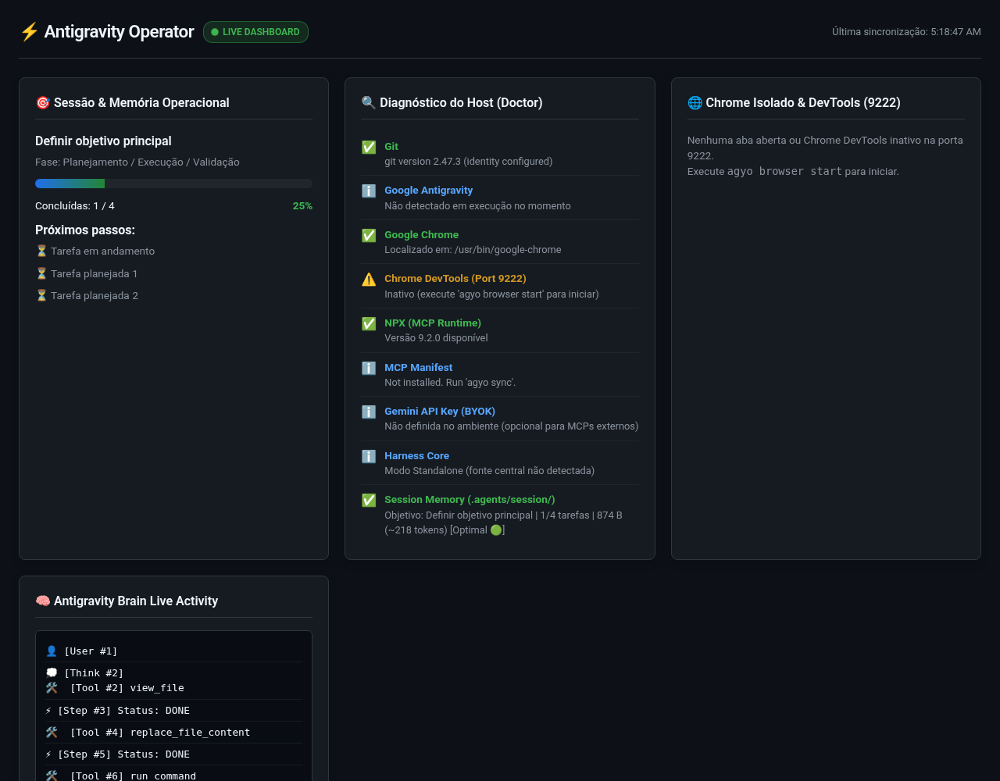

# Antigravity Operator (`agyo`)

<p align="center">
  <a href="https://github.com/tiagovilasboas/antigravity-operator/releases"></a>
  <a href="https://github.com/tiagovilasboas/antigravity-operator/actions"></a>
  <a href="https://goreportcard.com/report/github.com/tiagovilasboas/antigravity-operator"></a>
  
  
  
  
  
  
</p>

O **Antigravity Operator (`agyo`)** é o runtime de sessão de código aberto e outer harness para o Google Antigravity. Ele conecta o **Google NotebookLM (o Cérebro de Pesquisa)** ao **Antigravity (as Mãos Executoras)** — permitindo que desenvolvedores e estudantes absorvam playlists de vídeos do YouTube, livros técnicos e papers acadêmicos para gerar artigos técnicos aprofundados, roteiros de estudo e implementações de código verificadas com zero context bloat e ~99% de economia de tokens. Governado pelo modelo Outer Harness de Martin Fowler (Guia × Sensor), memória de sessão em disco (`.agents/session/`), checkpoints git atômicos com rollback instantâneo e supervisão do Chrome via CDP em Go puro.

Agentes: leiam o [AGENTS.md](AGENTS.md) primeiro.

## Início em 30 segundos

Instale o binário da release (macOS/Linux, conferido contra o `checksums.txt`) ou use o Homebrew:

```bash
curl -fsSL https://raw.githubusercontent.com/tiagovilasboas/antigravity-operator/main/scripts/install.sh | bash
# ou
brew install tiagovilasboas/tap/agyo
```

Depois, dentro de qualquer repositório git:

```bash
agyo init             # cria .agents/session/ e .agentignore
agyo session status   # objetivo, fase e progresso das tarefas
agyo dashboard        # UI local em http://127.0.0.1:8080 (use --open=false numa máquina sem tela)
```

Nenhum desses comandos precisa do Chrome. Ele só é necessário para `agyo browser ...`. O painel de atividade é preenchido quando o Antigravity grava um transcript de sessão. A Formula do Homebrew compila a partir do código-fonte e pode ficar atrás da última release; as outras opções estão em [Instalação](#-instalação-e-início-rápido).



<p align="center">
  <a href="README.md">🇺🇸 <b>Read in English</b></a> | <a href="#-instalação-e-início-rápido"><b>Instalação</b></a> | <a href="#-caso-de-uso-de-destaque-estudantes-pesquisa--google-ai-pro"><b>Edição Estudante</b></a> | <a href="#-sponsor--apoie-o-projeto"><b>Sponsor</b></a> | <a href="#-como-contribuir"><b>Contribuir</b></a>
</p>

> **Aviso:** *Este é um projeto comunitário de código aberto e não é um produto oficial patrocinado pelo Google. Foi concebido para estender e potencializar o ecossistema do Google Antigravity e desenvolvedores Google AI.*

---

## 📑 Sumário

- [Visão Geral](#-visão-geral)
- [Presente para a Comunidade & Google AI Pro](#-um-presente-de-engenharia-para-a-comunidade--para-o-google)
- [O Problema: Por Que o Antigravity Precisa de um Operator?](#-o-problema-por-que-o-antigravity-precisa-de-um-operator)
- [A Solução & Recursos Principais](#-a-solução-o-que-o-antigravity-operator-resolve)
- [Comparativo de Mercado](#-comparativo-onde-o-agyo-se-posiciona)
- [Caso de Uso para Estudantes e Google AI Pro](#-caso-de-uso-de-destaque-estudantes-pesquisa--google-ai-pro)
- [Arquitetura do Sistema (SRP, KISS, YAGNI, DRY)](#️-arquitetura-canônica-srp-kiss-yagni-dry)
- [Assisted-IA & Ecossistema de Agentes](#-assisted-ia--ecossistema-de-agentes)
- [Instalação e Início Rápido](#-instalação-e-início-rápido)
- [Como Usar a CLI](#-como-usar)
- [Princípios Operacionais Canônicos](#️-princípios-operacionais-canônicos)
- [Como Contribuir](#-como-contribuir)
- [Sponsor & Apoie o Projeto](#-sponsor--apoie-o-projeto)
- [Segurança, Privacidade & Licença](#-segurança-privacidade--licença)

---

## 🔭 Visão Geral

O **Antigravity Operator** (`agyo`) envolve as sessões do Google Antigravity com memória em disco, checkpoints git, um dashboard local e um perfil do Chrome supervisionado. Ele não coloca o agente numa sandbox: os comandos que o agente executa continuam com as permissões do seu usuário.

Implementando o modelo canônico de **Outer Harness (Martin Fowler)**, o `agyo` oferece:
1. **Simbiose Cérebro & Mãos (Grounded Multimodal RAG):** Conecta o **Google NotebookLM** via CDP e MCP para fundamentar sessões de código e estudo em playlists de vídeos do YouTube, livros técnicos e papers com timestamps e citações exatas — a custo zero de tokens na janela de contexto do agente.
2. **Memória de sessão determinística:** O estado persiste direto em `.agents/session/` no disco (`state.md`, `decisions.md`, `todo.md`), eliminando a amnésia de contexto.
3. **Perfil separado do Chrome:** Inicia e supervisiona uma instância dedicada do Chrome na porta `9222` (`~/.gemini/antigravity-browser-profile`), para que a navegação do agente fique fora do seu perfil pessoal. É um perfil separado, não uma sandbox: qualquer processo que alcance a porta do DevTools controla esse navegador.
4. **Paridade com Linux headless e servidores:** Detecta a ausência de ambiente gráfico (`$DISPLAY` / `$WAYLAND_DISPLAY`) e ativa flags robustas de servidor (`--headless=new`, `--disable-dev-shm-usage`, `--no-sandbox`).
5. **Portabilidade em binário único:** Escrito em Go puro com `CGO_ENABLED=0` e templates embutidos (`//go:embed`), gerando um único executável autocontido, sem dependências de runtime.

---

## 🎁 Um Presente de Engenharia para a Comunidade & para o Google

> *"Este projeto é uma contribuição aberta da comunidade para todos os desenvolvedores, estudantes e pesquisadores, e um agradecimento especial ao **Google** pelo incentivo transformador concedido aos estudantes através do plano **Google AI Pro**."*  
>  
> Nosso objetivo é democratizar a engenharia de ponta: permitir que qualquer estudante ou desenvolvedor utilize 100% do poder do **Google Antigravity e dos modelos Gemini Pro** com rigor profissional, sem queimar cotas de API com loops desgovernados e com portabilidade absoluta para qualquer laboratório Linux ou macOS.

---

## 🔍 O Problema: Por Que o Antigravity Precisa de um Operator?

O Google Antigravity é uma das plataformas de desenvolvimento assistido por IA mais poderosas da atualidade: possui ferramentas atômicas nativas de shell, edição cirúrgica, MCPs e subagentes. 

**Porém, "de fábrica", o Antigravity é uma engine de força bruta sem um Harness de Sessão embutido:**
* **Concorrentes já empacotam guard-rails:** Ferramentas como Claude Code, Devin ou Cursor possuem convenções prontas ou sandboxes fechadas. O Antigravity te entrega as ferramentas atômicas puras (`run_command`, `write_to_file`), mas **não entrega a camada de governança e controle de sessão**.
* **Sem memória de longo prazo:** Ele não possui um protocolo nativo de persistência de estado no disco, gerando amnésia operacional a cada nova janela de contexto.
* **Sem automação de ambiente de runtime:** O usuário precisa configurar manualmente portas CDP, isolamento de perfis de browser e contornar peculiaridades de Linux na unha.

### As 4 Falhas Críticas de Agentes sem Governança:

1. **A Síndrome do "Agente Bêbado" no Terminal:** Agentes que ganham acesso a shell e executam comandos sem freio, alucinam diretórios, assumem que código funciona sem testar e entram em loops infinitos consumindo tokens.
2. **Amnésia Operacional e Estouro de Contexto:** Conforme a conversa avança, o agente esquece o objetivo principal, descarta decisões arquiteturais combinadas e repete erros já cometidos.
3. **Invasão e Risco no Navegador Pessoal:** Agentes que tentam interagir com a web sequestrando ou sujando o navegador pessoal do desenvolvedor, expondo cookies privados, abas de trabalho ou travando por falta de flags corretas.
4. **O Abismo Mac vs Linux:** Automações que funcionam no macOS com interface gráfica quebram miseravelmente quando levadas para um servidor Linux, VPS, WSL2 ou container Docker (ausência de servidor X11/Wayland, crashes de memória em `/dev/shm` e permissões de sandbox).

---

## 💡 A Solução: O Que o `antigravity-operator` Resolve

O **`antigravity-operator`** (`agyo`) empacota toda a infraestrutura operacional, segurança e governança para que o seu agente atue como um **engenheiro de software e operador de sistemas sênior**:

* **Outer Harness de Martin Fowler (Guia × Sensor):** O agente nunca assume nada sem evidência direta. Guias alimentam o agente antes da ação; sensores computacionais (`go test`, linters, verificação de runtime) são o que as regras pedem para o agente rodar antes de declarar a tarefa pronta. O `agyo` fornece as regras e os sensores; ele não os impõe.
* **A Conexão Simbiótica "Cérebro & Mãos" (NotebookLM + Antigravity):** Em vez de entupir a janela de contexto do agente com dezenas de manuais e PDFs densos (gerando context bloat e degradação de atenção), o `agyo` conecta o agente ao **Google NotebookLM**. O NotebookLM atua como o **cérebro de pesquisa fundamentada com citações**, e o Antigravity como as **mãos executoras de código** com verificação e testes rigorosos.
* **Memória Operacional Persistente (`.agents/session/`):** Transições de estado vivem no filesystem do projeto (`state.md`, `decisions.md`, `todo.md`). O agente mantém coerência perfeita mesmo se a janela de chat reiniciar.
* **Perfil Separado do Chrome via DevTools MCP:** Lança uma instância dedicada do Chrome com porta de depuração (`9222`) e perfil próprio (`~/.gemini/antigravity-browser-profile`), separado do seu navegador pessoal. Não é uma sandbox.
* **Adaptação Inteligente Headless (Linux & Servidores):** Detecta dinamicamente a presença de display gráfico (`$DISPLAY` / `$WAYLAND_DISPLAY`). Se não houver tela, ativa automaticamente `--headless=new`, `--disable-dev-shm-usage` e `--no-sandbox`.
* **Zero Runtime Dependencies (Single Binary Go):** Compilado em Go puro (`CGO_ENABLED=0`), gerando um executável estático único que você pode copiar para qualquer Linux ou Mac e rodar na hora, sem instalar Python, Node ou gerenciadores de pacotes.

---

## 🥊 Comparativo: Onde o `agyo` se Posiciona

| Recurso | Scripts Soltos / Bash | Claude Computer Use | Open-Interpreter | **Antigravity Operator (`agyo`)** |
|---|---|---|---|---|
| **Governança Outer Harness** | ❌ Não | ❌ Não | ❌ Não | **✅ Nativo (Guia × Sensor)** |
| **Memória Operacional em Disco** | ❌ Não | ❌ Não | ❌ Não | **✅ `.agents/session/` Canônico** |
| **Ponte Grounded RAG (NotebookLM)** | ❌ Não | ❌ Não | ❌ Não | **✅ Nativo (`agyo notebooklm` & MCP)** |
| **Browser Profile Isolado** | ❌ Usa pessoal | ⚠️ Container pesado | ❌ Não | **✅ Perfil Dedicado (`9222`)** |
| **Paridade macOS / Linux** | ⚠️ Quebra fácil | ⚠️ Docker-only | ⚠️ Conflito de deps | **✅ Nativo & Headless Auto** |
| **Dependências de Instalação** | Múltiplas | Docker / APIs | Python / venv / pip | **✅ Binário Único Estático** |
| **Sensor de Ambiente (`doctor`)** | ❌ Não | ❌ Não | ❌ Não | **✅ Integrado na CLI** |

---

## 🎓 Caso de Uso de Destaque: Estudantes, Pesquisa & Google AI Pro

Para estudantes de tecnologia, computação e engenharia que utilizam os benefícios de planos acadêmicos como o **Google AI Pro**, o `antigravity-operator` se torna o multiplicador de aprendizado definitivo:

1. **Economia de Cota:** o `.agentignore` mantém dependências, lockfiles e dumps fora do prompt, e o `agyo session compact` mantém o `todo.md` curto.
2. **Ambiente Portátil para Laboratórios da Faculdade (Linux sem Root):** Computadores de universidades e centros de pesquisa rodam Linux onde o estudante não possui privilégios de administrador (`root`) para instalar Docker ou dependências globais. O binário estático `agyo-linux-amd64` roda direto da pasta do usuário (`~/`), sem necessitar de permissões especiais.
3. **Diário de Bordo de Estudos & Portfólio:** A pasta `.agents/session/` registra o histórico técnico, trade-offs de algoritmos e decisões de código, servindo como documentação viva do aprendizado.
4. **Perfil de Navegador Separado:** A navegação do agente roda num perfil próprio do Chrome, longe dos seus logins pessoais. Não é uma sandbox.
5. **Simbiose com o Google NotebookLM (Grounded RAG sem Custo de Contexto):** Estudantes e engenheiros podem carregar vídeos do YouTube, livros inteiros, papers e ementas no NotebookLM. Com o `agyo notebooklm`, o agente do Antigravity pesquisa diretamente nos cadernos para transformar vídeos e referências em artigos técnicos, guias de estudo e código fundamentado antes de programar, sem estourar a janela de contexto.

### 🎁 Skills para Estudantes Incluídas de Brinde (`skills/`):
O repositório já inclui 3 skills prontas para acelerar a rotina acadêmica:
* **`feynman-code-tutor`:** Tutor sênior baseado na Técnica Feynman. Explica algoritmos, estruturas de dados e Big-O com analogias do mundo real e perguntas de fixação.
* **`student-study-planner`:** Decompõe ementas pesadas, projetos finais e matérias complexas em sprints gerenciáveis de estudo focado (20% teoria, 80% código).
* **`token-budget-guard`:** Guardião cirúrgico que impede respostas repetitivas ou leitura desnecessária de arquivos, estendendo a longevidade da sua cota do Google AI Pro.

---

## 🏛️ Arquitetura Canônica (SRP, KISS, YAGNI, DRY)

```text
antigravity-operator/
├── cmd/agyo/                 # Entrypoint da CLI (main.go)
├── internal/
│   ├── platform/             # SRP: Detecção de SO, display X11/Wayland e caminhos do Chrome
│   ├── session/              # SRP: Scaffold da memória operacional (.agents/session/) e proteção de logs
│   ├── checkpoint/           # SRP: Snapshots atômicos da working tree e rollback
│   ├── profile/              # SRP: Gerenciamento do Chrome com perfil isolado e endpoint CDP 9222
│   ├── watcher/              # SRP: Streaming de raciocínio, árvore de subagentes e notificações de OS
│   ├── exporter/             # SRP: Exportador de relatórios consolidados de missão (Markdown e HTML)
│   ├── analytics/            # SRP: Parsing de transcripts, métricas de chamadas de ferramentas e redação de segredos
│   ├── dashboard/            # SRP: Mini-servidor HTTP embutido em Go puro, UI web e API REST
│   ├── completion/           # SRP: Gerador de autocompletion de shell (Bash, Zsh, Fish)
│   ├── hook/                 # SRP: Sensor e guarda de continuidade de sessão para o Git pre-commit
│   ├── installer/            # SRP: Sincronização idempotente de regras e manifestos MCP
│   ├── notebook/             # SRP: Integração nativa com Google NotebookLM e servidor MCP stdio
│   └── doctor/               # SRP: Sensor computacional de diagnóstico completo da máquina
├── templates/                # Embutido no binário estático via //go:embed (zero dependências)
│   ├── rules/                # Regras canônicas de Session Agent
│   ├── session/              # Templates de state.md, decisions.md e todo.md
│   └── mcps/                 # Manifesto de servidores MCP (DevTools, Playwright)
├── Formula/                  # Fórmula oficial do pacote Homebrew (agyo.rb)
├── agents/                   # Personas especializadas para engenharia assistida por IA
├── skills/                   # Habilidades bônus para estudantes (feynman tutor, study planner, token guard)
├── docs/                     # Especificações de arquitetura e artigos de lançamento (TabNews, LinkedIn)
├── .github/                  # CI/CD workflows, release automation e templates comunitários
├── scripts/                  # Instalador universal (install.sh) e setup de desenvolvimento (setup-dev.sh)
├── AUTHORS                   # Autores do projeto
├── CONTRIBUTORS              # Colaboradores do projeto
├── CODE_OF_CONDUCT.md        # Diretrizes comunitárias padrão Google Open Source
├── SECURITY.md               # Política de divulgação responsável de vulnerabilidades
├── PRIVACY.md                # Política de privacidade local-first e zero-telemetria (LGPD & GDPR)
├── CONTRIBUTING.md           # Guia de contribuição e protocolo de testes
└── Makefile                  # Alvos de build nativo, lint, coverage e cross-compilação
```

> 📖 **Especificação Detalhada de Engenharia e Arquitetura:**  
> Para uma análise aprofundada de cada subsistema, implementação RFC 6455 do CDP WebSocket em Go puro, algoritmos de memória $O(1)$ e decisões de design, leia o [Índice de Especificações do Sistema (docs/spec/)](docs/spec/README.md).

---

## 🤖 Assisted-IA & Ecossistema de Agentes

O projeto foi concebido sob o paradigma **Agent-as-Code** e traz governança de ponta:
- **`AGENTS.md`:** Contrato operacional de conduta, diretrizes de código Go, checklist de sensores computacionais e convenções de commit para qualquer IA (Antigravity, Cursor, Claude, Copilot).
- **Roster de Especialistas (`agents/`):**
  - **`operator-architect`:** Guardião do sistema operacional, paridade macOS/Linux e princípios KISS/YAGNI.
  - **`cdp-engineer`:** Especialista no Chrome DevTools Protocol, flags de browser e sockets de depuração.
  - **`qa-sentinel`:** Responsável pelos testes automatizados e sensores de regressão.

---

## ⚡ Instalação e Início Rápido

### Opção 1: Instalador Universal em Uma Linha (Recomendado / Zero Config)
Instala os binários estáticos diretamente no macOS ou Linux (sem necessidade de ter Go instalado):
```bash
curl -fsSL https://raw.githubusercontent.com/tiagovilasboas/antigravity-operator/main/scripts/install.sh | bash
```
Os arquivos também estão na página de [Releases](https://github.com/tiagovilasboas/antigravity-operator/releases). A partir da v0.4.6 eles têm attestation de build provenance; veja no [SECURITY.md](SECURITY.md) como verificar com `gh attestation verify`.

### Opção 2: Homebrew (macOS & Linuxbrew)
```bash
brew install tiagovilasboas/tap/agyo
```

### Opção 3: Compilar do Código Fonte (Go 1.27+, ver go.mod)
```bash
git clone https://github.com/tiagovilasboas/antigravity-operator.git
cd antigravity-operator
make build
make install
```

---

## 🚀 Como Usar

### 1. Diagnosticar o ambiente da máquina (`doctor`)
Audita se o sistema operacional, Git, Chrome, Node/NPX e conexões de harness estão prontos:
```bash
# Diagnóstico interativo padrão:
agyo doctor

# Saída em formato JSON para extensões e scripts:
agyo doctor --json

# Sensor de autorrecuperação (Self-Healing): repara arquivos ausentes ou corrompidos:
agyo doctor --fix
```

### 2. Inicializar a memória operacional no projeto atual (`init`)
Cria a pasta `.agents/session/` com rastreamento de estado, decisões e tarefas, além do `.agentignore`:
```bash
cd meu-projeto
agyo init
```

Estrutura criada:
- `.agents/session/state.md` (Objetivo e status em tempo real)
- `.agents/session/decisions.md` (Log de premissas e trade-offs arquiteturais)
- `.agents/session/todo.md` (Tarefas em andamento, pendentes e concluídas)
- `.agents/.gitignore` (Protegendo logs e credenciais contra commits acidentais)
- `.agentignore` (Lista negra de tokens: exclui `node_modules/`, `vendor/`, lockfiles e dumps)

### 3. Inspecionar e Gerenciar a Memória de Sessão (`session`)
Acompanhe o progresso ativo, faça streaming do raciocínio em tempo real ou arquive missões concluídas:
```bash
# Ver objetivo atual, fase e porcentagem de tarefas concluídas (suporta --json):
agyo session status
agyo session status --json

# Compactar tarefas concluídas para evitar context bloat de tokens:
agyo session compact
agyo session compact --dry-run
agyo session compact --threshold 5 --keep 3

# Acompanhar raciocínio e chamadas de ferramentas em tempo real com notificações nativas:
agyo session watch

# Inspecionar a árvore de subagentes ativos e mensagens inter-agentes:
agyo session watch --once --steps 10 --tree

# Exportar relatório consolidado da sessão em Markdown ou HTML responsivo completo:
agyo session export --format=markdown
agyo session export --format=html --out=relatorio-sessao.html

# Arquivar sessão concluída para o histórico e resetar templates para a próxima tarefa:
agyo session archive

# Listar histórico de sessões arquivadas (suporta --json):
agyo session list
agyo session list --json

# Restaurar sessão arquivada para a memória ativa (gera backup preventivo automático):
agyo session restore session-2026-10-01-113140.md
agyo session restore latest
```

### 4. Checkpoints Atômicos & Botão de Pânico (`checkpoint` & `rollback`)
Crie um snapshot antes de o agente começar edições arriscadas e faça rollback se algo der errado. O rollback restaura os arquivos rastreados, remove os arquivos criados depois do checkpoint e mantém `.agents/` e os arquivos que já não eram rastreados (mantidos, não incluídos no snapshot):
```bash
# Criar snapshot atômico antes de um refactor complexo:
# (as flags vêm antes do nome)
agyo checkpoint --desc="Antes de alterar migrations do banco" pre-refactor

# Listar checkpoints salvos (suporta --json):
agyo checkpoint --list
agyo checkpoint --list --json

# Desfaz as alterações do agente até o último checkpoint (ou um específico):
agyo rollback
agyo rollback chk-20261001-113000
```
Se houve commits depois do checkpoint, o `rollback` move a branch atual de volta ao commit do checkpoint (recusa com HEAD destacado ou em outra branch). Antes, guarda as alterações não commitadas num stash e mostra como desfazer (`git reset --hard <antigo>`, também no `git reflog`). A pasta `.agents/` nunca é alterada.

### 5. Proteção contra Desperdício de Tokens (`.agentignore`)
Ao rodar `agyo init`, uma lista negra `.agentignore` pré-configurada é criada para impedir que agentes carreguem dependências pesadas no contexto do prompt:
- Exclui saída de build e dependências (`node_modules/`, `vendor/`, `dist/`, `build/`, `target/`)
- Exclui lockfiles (`package-lock.json`, `pnpm-lock.yaml`, `yarn.lock`)
- Exclui dumps grandes, datasets, bundles minificados (`*.min.js`) e arquivos `.env` locais

### 6. Dashboard Web & Inspetor Local em Tempo Real (`dashboard`)
Inicia um servidor web em Go puro com zero dependências externas em `http://127.0.0.1:8080`, com UI dark mode moderna, progresso de sessão, diagnósticos do host, abas ativas do Chrome e live activity log:
```bash
# Iniciar dashboard e abrir automaticamente no navegador padrão:
agyo dashboard

# Iniciar em porta customizada sem abrir o navegador automaticamente:
agyo dashboard --port 8090 --open=false
```

### 7. Gerenciar o Chrome isolado e Inspeção CDP (`browser`)
Controla o ciclo de vida da instância exclusiva do Chrome e permite inspeção direta via Chrome DevTools Protocol em Go puro (sem Node/Python):
```bash
# Iniciar normalmente (abre janela no Mac/Linux desktop na porta 9222):
agyo browser start

# Iniciar em porta customizada ou forçar modo headless (automático em servidores Linux/VPS sem tela):
agyo browser start --port 9223
agyo browser start --headless

# Verificar se a porta de debug e o PID estão ativos:
agyo browser status

# Inspeção nativa via Chrome DevTools Protocol (CDP em Go puro):
agyo browser tabs                    # Lista abas abertas e target IDs
agyo browser open https://github.com # Abre URL em nova aba
agyo browser close <targetId>        # Fecha aba por target ID
agyo browser eval "document.title"   # Executa JS na aba ativa
agyo browser shot screenshot.png     # Captura screenshot PNG da aba ativa

# Encerrar graciosamente o processo do Chrome isolado (SIGTERM):
agyo browser stop
```

### 8. Integração Nativa com Google NotebookLM (`notebooklm`)
Conecta o Google Antigravity e sessões de terminal diretamente ao **Google NotebookLM** via DevTools CDP em Go puro e servidor Model Context Protocol (MCP) via stdio (zero dependências de Python ou Node).

#### 💡 O Fluxo Transformador: Vídeos → Artigos Técnicos & Código Verificado
O maior potencial desta integração é transformar o consumo passivo (vídeos longos do YouTube, aulas, documentações, livros) em **artigos técnicos fundamentados, guias de estudo estruturados e código implementado com testes** no seu ambiente local:

```text
[ Vídeo do YouTube / Curso / Paper ]
                │
                ▼
     [ Google NotebookLM ] ── (Índice multimodal, transcrição oficial e citações com timestamps a 0 tokens)
                │
                ▼ (CDP em Go puro / RFC 6455 WebSocket / stdio MCP)
     [ agyo notebooklm / MCP ] ── (`notebooklm_ask` ou `agyo notebooklm ask`)
                │
                ▼
     [ Google Antigravity ] ── (Sintetiza artigos técnicos aprofundados e código funcional)
                │
                ▼
[ ~/Estudos/artigos/*.md + Testes Unitários ] ── (Ativos perenes de estudo, arquitetura documentada e código verificado)
```

1. **Ingestão com Custo Zero de Tokens:** Cole links de vídeos do YouTube, PDFs ou documentações num caderno do NotebookLM. O NotebookLM processa transcrições completas, timestamps e diagramas nos embeddings multimodais do Gemini 1.5 Pro a **custo zero de tokens** para o seu agente.
2. **Consulta Fundamentada via CDP/MCP:** O Antigravity consulta o caderno com perguntas cirúrgicas (`agyo notebooklm ask <id> "..."` ou MCP `notebooklm_ask`).
3. **Geração de Artigos Estruturados & Guias de Estudo:** O Antigravity redige artigos técnicos completos, tutoriais no estilo Feynman ou ADRs de arquitetura diretamente na sua pasta de estudos (ex.: `~/Estudos/artigos/`).
4. **Implementação e Validação de Código:** O agente transforma os conceitos teóricos em código executável, validando de ponta a ponta com testes unitários e verificações no browser.

#### 💰 Economia de Tokens (FinOps): ~99,2% de Redução de Cota
* **Sem NotebookLM:** Injetar a transcrição de 1h de vídeo (~25.000 tokens) ou capítulos de livro (~100.000 tokens) na janela de contexto consome **mais de 1.500.000 tokens de input** ao longo de 15 turnos de conversa, estourando limites de TPM e causando severa amnésia (*Lost in the Middle*).
* **Com `agyo notebooklm`:** A base densa fica externalizada. Uma pergunta de 60 tokens retorna uma resposta citada de ~500 tokens. O consumo acumulado em 15 turnos cai para apenas ~12.000 tokens — **uma economia efetiva de ~99,2% de tokens**.

```bash
# 1. Verificar status de autenticação e conexão com o Google NotebookLM:
agyo notebooklm status

# 2. Abrir o Chrome isolado diretamente no Google NotebookLM (sessão Google preservada):
agyo notebooklm open

# 3. Listar todos os cadernos da sua conta Google:
agyo notebooklm list

# 4. Fazer perguntas fundamentadas com citações exatas às fontes de um caderno:
agyo notebooklm ask <notebook-id> "Explique o algoritmo de consenso do vídeo e implemente em Go"

# 5. Enviar notas markdown, código ou resumos locais de volta para o caderno:
agyo notebooklm push <notebook-id> ~/Estudos/artigos/sistemas-distribuidos.md

# 6. Servidor stdio Model Context Protocol (MCP) para Antigravity, Claude Code ou Cursor:
agyo notebooklm mcp
```
*(Aliases curtos suportados: `agyo notebook` e `agyo nblm`)*

### 9. Git Pre-Commit Hook de Continuidade (`hook`)
Instala um script em `.git/hooks/pre-commit` que mostra o status da sessão quando o `agyo` está no seu PATH. Quando o `todo.md` tem 5 ou mais tarefas concluídas, ele também roda `agyo session compact` e depois `git add .agents/session/`, então os arquivos de sessão compactados entram no mesmo commit. É um lembrete, não um portão: sempre termina com exit 0 e nunca bloqueia um commit:
```bash
# Instalar o hook no repositório atual (ou diretório especificado):
agyo hook install

# Desinstalar o hook quando necessário:
agyo hook uninstall
```

### 10. Sincronizar regras, skills e MCPs no Antigravity (`sync`)
Garante que as regras de governança e servidores de automação estejam instalados:
```bash
agyo sync
```
O `sync` nunca sobrescreve um manifesto MCP existente (`~/.gemini/antigravity/mcp/default-servers.json`). O `agyo doctor` avisa quando esse arquivo tem pacotes `npx` sem versão fixa ou difere do template embutido. Para fazer backup (`default-servers.json.bak-<timestamp UTC>`) e reescrevê-lo:
```bash
agyo sync --update-mcp
```

### 11. Autocompletar no Terminal (`completion`)
Gera scripts de autocompletion de comandos e flags para Zsh, Bash ou Fish:
```bash
# Zsh (adicione ao seu ~/.zshrc):
source <(agyo completion zsh)

# Bash (adicione ao seu ~/.bashrc):
source <(agyo completion bash)

# Fish:
agyo completion fish | source
```

### 12. Sobre o projeto e manifesto (`about`)
```bash
agyo about
```

---

## 🛡️ Princípios Operacionais Canônicos

Quando o Antigravity opera sob o `agyo`, ele segue 5 mandamentos:
1. **Autonomia de Investigação:** Busca fatos no terminal, browser e logs antes de fazer perguntas triviais.
2. **Orquestração Multiferramenta:** Identifica -> Investiga -> Implementa -> Testa -> Valida no Browser.
3. **Validação Rigorosa:** A tarefa só termina quando o resultado foi validado de ponta a ponta com evidências.
4. **Perfil Separado:** Nunca controlar o Chrome pessoal do usuário.
5. **Comunicação Concisa:** Direta ao ponto, técnica e fundamentada em dados.

---

## 🤝 Como Contribuir

Contribuições de engenheiros, estudantes e entusiastas de open source são muito bem-vindas! Seja corrigindo bugs, aprimorando a documentação ou criando novas skills.

### Fluxo de Contribuição em 5 Passos:
1. **Fork & Clone:**
   ```bash
   git clone https://github.com/tiagovilasboas/antigravity-operator.git
   cd antigravity-operator
   ```
2. **Setup Automatizado de Dev (configura hooks de pre-commit):**
   ```bash
   ./scripts/setup-dev.sh
   ```
3. **Crie uma Branch de Funcionalidade:**
   ```bash
   git checkout -b feat/sua-funcionalidade
   ```
4. **Execute os Sensores e Testes:**
   ```bash
   go vet ./...
   go test -v -race ./...
   make build
   ./bin/agyo doctor
   ```
5. **Abra um Pull Request:** Siga o padrão [Conventional Commits](https://www.conventionalcommits.org/) em inglês e submeta seu PR.

### 💡 Ideias de Contribuição de Alto Impacto:
* **Skills para Estudantes:** Crie novas skills acadêmicas na pasta `skills/` (ex: tutor de grafos, revisor de monografia/TCC).
* **Integrações de MCP:** Adicione templates de servidores MCP úteis em `templates/mcps/`.
* **Testes em Outras Distribuições Linux:** Documente a compatibilidade no Arch Linux, Alpine, Fedora ou NixOS.

Consulte também [CONTRIBUTING.md](CONTRIBUTING.md) (o que é aceito), [CODE_OF_CONDUCT.md](CODE_OF_CONDUCT.md), [AUTHORS](AUTHORS) e [CONTRIBUTORS](CONTRIBUTORS).

---

## 💖 Sponsor & Apoie o Projeto

Este projeto é uma iniciativa independente e de código aberto criada para empoderar estudantes e desenvolvedores que utilizam o ecossistema Google AI e Google Antigravity.

Se o `antigravity-operator` economizou seu tempo, protegeu sua cota de tokens ou ajudou em seus estudos:

* ⭐ **Deixe uma Estrela (Star) no Repositório:** É a forma mais fácil e direta de ajudar o projeto a alcançar mais pessoas e chamar a atenção do time do Google.
* 💖 **Patrocine no GitHub Sponsors:** Ajude a custear os servidores de integração contínua e testes multi-OS através do [GitHub Sponsors](https://github.com/sponsors/tiagovilasboas).
* 🗣️ **Compartilhe com sua Comunidade:** Fale sobre o projeto no LinkedIn, X/Twitter, Discord ou grupos de estudo da faculdade.

---

## 🔒 Segurança, Privacidade & Licença

* **Política de Segurança:** Consulte [SECURITY.md](SECURITY.md) para diretrizes de divulgação responsável de vulnerabilidades.
* **Privacidade e Conformidade LGPD/GDPR:** Consulte [PRIVACY.md](PRIVACY.md) para detalhes sobre a política local-first, zero-telemetria e soberania total de dados sob a LGPD (Lei Federal 13.709/2018).
* **Licença:** Distribuído sob a licença [MIT](LICENSE).

