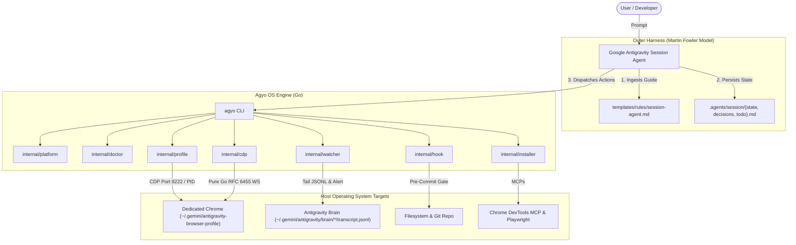

# Antigravity Operator (`agyo`) Architecture Specification

[🇧🇷 Leia em Português](ARCHITECTURE.pt-BR.md)

---

## 1. System Overview

`antigravity-operator` operates as a deterministic runtime and outer harness layer between the **AI Model** (Gemini Pro in Google Antigravity) and the **Developer's Operating System** (macOS or Linux).

---

## 2. Session Lifecycle & State Transitions

1. **Scaffolding (`agyo init`):**
   * Initializes `.agents/session/`.
   * Provisions `state.md`, `decisions.md`, and `todo.md` using canonical templates.
   * Creates `.agents/.gitignore` to prevent secret leaks, debug dumps, and ephemeral runtime logs from entering version control.

2. **Host Diagnostics (`agyo doctor`):**
   * Assesses machine readiness across Git configuration, Chrome installation, Node/NPX availability, display server status (X11/Wayland/Headless), Antigravity process presence, BYOK keys, and central `harness-core` integration.
   * Emits deterministic statuses (`OK`, `WARN`, `FAIL`, `INFO`).

3. **Browser Lifecycle & Native CDP (`agyo browser`):**
   * Spawns an isolated Google Chrome instance bounded to `~/.gemini/antigravity-browser-profile`.
   * Exposes remote debugging port `9222` (or user-defined `--port`).
   * Automatically falls back to headless flags (`--headless=new`, `--disable-dev-shm-usage`, `--no-sandbox`) when operating in headless Linux servers, Docker containers, or headless WSL2.
   * Tracks process ID in `chrome.pid` and enables graceful teardown via `agyo browser stop` (SIGTERM with SIGKILL timeout fallback).
   * Provides pure-Go Chrome DevTools Protocol subcommands (`tabs`, `open`, `close`, `eval`, `shot`) over RFC 6455 WebSockets without external Node or Python dependencies.

4. **Brain Streaming & Desktop Alerts (`agyo session watch`):**
   * Tails active Antigravity session transcripts in real time (`~/.gemini/antigravity/brain/*/transcript.jsonl`).
   * Formats agent thoughts (`💭 Think`), tool invocations (`🛠️ Tool`), and user interactions (`👤 User`).
   * Fires native OS desktop alerts (`osascript` on macOS, `notify-send` on Linux, terminal bell `\a`) when `ask_question` or user input is requested.

5. **Filesystem Safety Net & Atomic Checkpoints (`agyo checkpoint` & `agyo rollback`):**
   * Creates atomic git porcelain commit snapshots before risky refactors.
   * Tracks uncommitted changes via `git stash create` without dirtying or modifying the active working tree.
   * Enables one-command panic button restoration (`agyo rollback`) restoring pristine filesystem state and appending audit log into `state.md`.

6. **Session Compaction & History Lifecycle (`agyo session compact/list/restore`):**
   * Prevents LLM context bloat with deterministic task rollup.
   * Lists archived missions with task completion metrics (`agyo session list`).
   * Restores historical sessions into active memory with automatic safety backup (`pre-restore-<timestamp>.md`).

7. **Token Blacklist Protection (`.agentignore`):**
   * Automatically scaffolded during `agyo init` to prevent agents from reading `node_modules/`, `vendor/`, lockfiles, dumps, and `.env` secrets into context.

8. **Session Continuity Pre-Commit Hook (`agyo hook`):**
   * Installs an outer harness sensor into `.git/hooks/pre-commit`.
   * Verifies that `.agents/session/state.md` and `todo.md` have been updated before allowing code commits.

9. **Rules & MCP Manifest Sync (`agyo sync`):**
   * Deploys canonical Session Agent directives into `~/.gemini/antigravity/rules/session-agent.md`.
   * Configures standard Model Context Protocol servers and automatically registers `notebooklm` in `mcp_config.json`.

10. **Native Google NotebookLM Bridge & Stdio MCP (`agyo notebook`):**
    * Bridges Antigravity agents and terminal sessions to Google NotebookLM notebooks and grounded sources.
    * Manages authentication and session readiness over CDP in dedicated Chrome without manual cookie extraction.
    * Exposes high-level commands: `status`, `open`, `list`, `ask`, and `push`.
    * Implements standard stdio MCP JSON-RPC 2.0 server (`agyo notebook mcp`), allowing direct tool calls from Antigravity, Cursor, and Claude.

---

## 3. Engineering Decisions & Principles

- **Single Responsibility Principle (SRP):** Each internal package (`platform`, `session`, `checkpoint`, `profile`, `installer`, `doctor`, `hook`, `watcher`, `dashboard`, `exporter`, `notebook`) is strictly decoupled.
- **Embedded Assets (`//go:embed`):** Eliminates external filesystem dependencies at runtime, ensuring offline, self-contained single-binary execution.
- **Pure Go / Zero CGO (`CGO_ENABLED=0`):** Guarantees dynamic linker independence across glibc, musl, and diverse Linux kernel distributions.
- **Zero Third-Party Runtime Dependencies:** All networking, WebSockets (RFC 6455), and JSONL streaming are implemented directly on Go's standard library.
