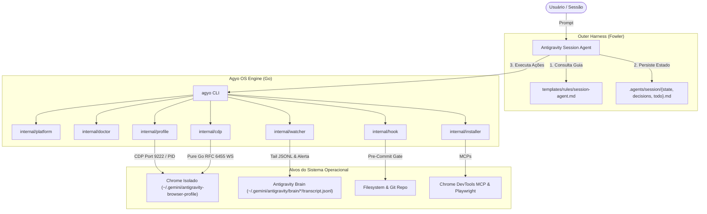

# Arquitetura do Antigravity Operator (`agyo`)

## 1. Visão Geral do Sistema

O `antigravity-operator` opera como uma camada de runtime e governança entre o **Modelo de IA** (como Gemini ou Claude no Antigravity) e o **Sistema Operacional do Desenvolvedor** (macOS ou Linux).

---

## 2. Ciclo de Vida da Sessão

1. **Inicialização (`agyo init`):**
   * Cria o diretório `.agents/session/`.
   * Cria os arquivos `state.md`, `decisions.md` e `todo.md` com templates canônicos caso não existam.
   * Cria `.agents/.gitignore` para impedir que credenciais e dados temporários de depuração sejam commitados acidentalmente.

2. **Diagnóstico da Máquina (`agyo doctor`):**
   * Avalia a saúde da máquina local: Git, Chrome, Node/NPX, exibição gráfica, processos do Antigravity, chaves BYOK e integração com o `harness-core`.
   * Classifica cada item como `OK`, `WARN`, `FAIL` ou `INFO`.

3. **Orquestração de Navegação e CDP Nativo (`agyo browser`):**
   * Lança o Google Chrome restrito ao diretório `~/.gemini/antigravity-browser-profile`.
   * Abre a porta de depuração remota `9222`.
   * Se executado em ambiente Linux sem servidor gráfico (`$DISPLAY`), automaticamente anexa as flags headless essenciais (`--headless=new`, `--disable-dev-shm-usage`, `--no-sandbox`).
   * Faz polling no endpoint `http://127.0.0.1:9222/json/version` até receber status 200 OK.
   * Fornece subcomandos nativos de inspeção CDP em Go puro (`tabs`, `open`, `close`, `eval`, `shot`) via WebSockets RFC 6455 sem dependências externas.

4. **Streaming de Raciocínio e Alertas Desktop (`agyo session watch`):**
   * Monitora em tempo real a transcrição da sessão ativa (`~/.gemini/antigravity/brain/*/transcript.jsonl`).
   * Formata pensamentos (`💭 Think`), chamadas de ferramentas (`🛠️ Tool`) e interação do usuário (`👤 User`).
   * Dispara alertas visuais e sonoros no sistema operacional (`osascript` no macOS, `notify-send` no Linux, bell terminal `\a`) quando o agente solicita resposta (`ask_question`).

5. **Rede de Segurança & Checkpoints Atômicos (`agyo checkpoint` & `agyo rollback`):**
   * Cria instantâneos atômicos do git antes de refatorações arriscadas.
   * Rastreia alterações não commitadas via `git stash create` sem sujar ou alterar o working tree ativo.
   * Permite rollback com um único comando (`agyo rollback`), restaurando o estado original e gravando log de auditoria no `state.md`.

6. **Compactação de Tarefas e Histórico de Sessões (`agyo session compact/list/restore`):**
   * Previne context bloat e desperdício de tokens LLM com rollup automático.
   * Lista o histórico de sessões com métricas de conclusão de tarefas (`agyo session list`).
   * Restaura sessões anteriores com backup preventivo automático (`pre-restore-<timestamp>.md`).

7. **Lista Negra de Tokens (`.agentignore`):**
   * Criado automaticamente durante o `agyo init` para proteger o contexto do modelo contra pastas densas (`node_modules/`, `vendor/`), lockfiles, dumps de banco e credenciais `.env`.

8. **Hook de Continuidade Pré-Commit (`agyo hook`):**
   * Instala um sensor do outer harness em `.git/hooks/pre-commit`.
   * Bloqueia commits caso `.agents/session/state.md` e `todo.md` não tenham sido atualizados na sessão.

9. **Sincronização de Regras e MCPs (`agyo sync`):**
   * Grava as regras canônicas do Session Agent em `~/.gemini/antigravity/rules/session-agent.md`.
   * Registra automaticamente os manifestos padrão de MCPs e o servidor `notebooklm` em `mcp_config.json`.

10. **Ponte Nativa do Google NotebookLM & Servidor MCP stdio (`agyo notebook`):**
    * Conecta os agentes de IA e o terminal aos cadernos e fontes do Google NotebookLM.
    * Gerencia a autenticação e estado da sessão via CDP no Chrome isolado (sem copiar cookies manualmente).
    * Fornece operações de alto nível: `status`, `open`, `list`, `ask` e `push`.
    * Executa como servidor stdio MCP JSON-RPC 2.0 nativo (`agyo notebook mcp`), permitindo chamadas diretas de ferramentas a partir do Antigravity, Cursor ou Claude.

---

## 3. Padrões de Projeto e Decisões de Engenharia

- **Single Responsibility Principle (SRP):** Cada pacote sob `internal/` (`platform`, `session`, `checkpoint`, `profile`, `installer`, `doctor`, `hook`, `watcher`, `dashboard`, `exporter`, `notebook`) possui um escopo estrito e não vaza detalhes de implementação para outros pacotes.
- **Embed Nativo (`//go:embed`):** Permite distribuição de binário único sem instaladores complexos ou necessidade de clonar o repositório em todas as máquinas.
- **Zero CGO (`CGO_ENABLED=0`):** Garante compatibilidade binária entre qualquer versão de kernel Linux e biblioteca C (glibc ou musl).
- **Zero Dependências Externas em Tempo de Execução:** Todo o código de rede, WebSockets (RFC 6455) e streaming de JSONL é implementado diretamente sobre a biblioteca padrão do Go.
