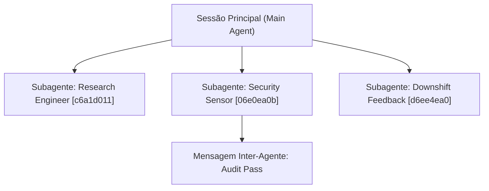

# Domínio 06: Observabilidade, Streaming de Transcrição e Dashboard Web

O `antigravity-operator` oferece visibilidade em tempo real sobre a linha de raciocínio, chamadas de ferramentas e subagentes concorrentes do Google Antigravity através dos pacotes `internal/watcher` e `internal/dashboard`.

---

## 1. Streaming Reativo de Transcrições (`internal/watcher`)

O motor de IA do Google Antigravity persiste os eventos da sessão em arquivos JSON Lines compactos:
`~/.gemini/<app>/brain/<conversation-id>/.system_generated/logs/transcript.jsonl`, onde `<app>` é `antigravity` (2.0), `antigravity-cli` ou `antigravity-ide` (ver `transcriptPath` em https://antigravity.google/docs/hooks/). CLI e dashboard usam a mesma função (`watcher.FindLatestTranscript`).

O `watcher` localiza dinamicamente a sessão mais recente analisando os timestamps de modificação das pastas em `brain/` e realiza o tailing reativo do arquivo.

### 1.1. Categorias de Eventos Mapeadas
Cada linha do log JSONL é parseada em estruturas ricas pelo método `ParseLine`:

| Tipo de Evento (`type`) | Formatação Visual na CLI | Significado |
|---|---|---|
| `USER_INPUT` | `👤 [USUÁRIO #step]` | Prompt ou mensagem submetida pelo desenvolvedor. |
| `PLANNER_RESPONSE` (Thinking) | `💭 [PENSAMENTO #step]` | Cadeia de raciocínio interno do modelo (Chain-of-Thought). |
| `PLANNER_RESPONSE` (Tool Call) | `🛠️  [FERRAMENTA #step] tool(args)` | Invocação de ferramentas (`write_to_file`, `run_command`, `replace_file_content`). |
| `MODEL_RESPONSE` (Content) | `🤖 [RESPOSTA #step]` | Explicação final visível enviada ao usuário. |
| `INTERACTION_REQUIRED` | `🔔 [INTERAÇÃO #step]` | O agente está esperando resposta (`ask_question`). |

---

## 2. Alertas Nativos no Sistema Operacional (`watcher.Notify`)

Quando o modelo aciona uma ferramenta interativa solicitando a decisão do usuário (ex: `ask_question`), desenvolvedores que estão em outra janela ou monitor não podem ficar esperando no escuro.

O `watcher.Notify` emite notificações nativas multiplataforma:
- **macOS:** Executa script AppleScript assíncrono via `osascript` disparando notificação no Notification Center com som `Glass`.
- **Linux:** Utiliza o utilitário nativo `notify-send` com prioridade crítica.
- **Terminal Bell (`\a`):** Emite caractere ASCII Bell para alertar no emulador de terminal.

---

## 3. Rastreamento Concorrente de Subagentes (`SubagentTree`)

Em workflows avançados, o agente principal pode disparar múltiplos subagentes em segundo plano (`invoke_subagent`) e coordenar tarefas através do `send_message`.

O `SubagentTree` gerencia essa hierarquia em memória com proteção de concorrência (`sync.RWMutex`):

Ao executar `agyo session watch --tree`, o operador renderiza a topologia completa de subprocessos com seus conversation IDs e papéis atribuídos.

---

## 4. O Servidor Web Dashboard (`internal/dashboard`)

Para equipes que preferem monitoramento visual ou desejam manter uma janela de controle aberta em um monitor secundário, o comando `agyo dashboard` inicializa um servidor HTTP nativo em Go puro na porta `8080` (ou customizada via `--port`).

### 4.1. Endpoints da REST API
| Rota HTTP | Função |
|---|---|
| `GET /` | Serve a interface web completa em HTML5/CSS3 com UI Dark Mode responsiva. |
| `GET /api/status` | Retorna o status da sessão em JSON (`Objective`, `DoneTasks`, `TotalTasks`, `HealthStatus`). |
| `GET /api/doctor` | Retorna o relatório do host com badges de status de cada sensor (sem nome e e-mail do git, que ficam só no `agyo doctor` local). |
| `GET /api/tabs` | Lista as abas ativas do Chrome DevTools e seus títulos em tempo real. |
| `GET /api/events` | Retorna os últimos eventos da sessão só com tipo, passo, ferramenta e status (sem texto de prompt, raciocínio, argumentos ou saída). |
| `GET /api/all` | Agrega todos os dados acima em uma única chamada atômica para polling eficiente da UI. |

### 4.2. Zero Dependências e Segurança
- O frontend da web UI é embarcado diretamente no código Go, sem exigir `npm install`, sem assets baixados de CDNs externos e funcionando 100% offline.
- O servidor escuta só em `127.0.0.1` e responde `403` a qualquer requisição cujo `Host` (ou `Origin`, quando presente) não seja `localhost`, `127.0.0.1` ou `[::1]` na porta em uso. Isso bloqueia DNS rebinding, em que uma página remota alcança a porta local com o próprio hostname.
- Encerramento gracioso via captura de sinais do SO (`SIGINT` e `SIGTERM`) com timeout de segurança de 2 segundos.

---

## 5. Decisões Técnicas & Trade-Offs

| Decisão | O Que Foi Escolhido | Alternativa Rejeitada | Racional & Trade-Off |
|---|---|---|---|
| **Estratégia do Watcher** | **Tailing reativo de arquivo JSONL com byte offset** | File polling completo regendo o arquivo do início | **Vantagem:** Consumo de CPU imperceptível mesmo com logs de transcripts atingindo dezenas de megabytes. **Trade-off:** Se o arquivo de log sofrer truncamento extremo ou rotação, o watcher precisa resetar o offset para 0. |
| **Notificações do SO** | **Detecção de binário nativo (`osascript` no Mac, `notify-send` no Linux)** | Bibliotecas CGO de desktop notification | **Vantagem:** Zero dependências compiladas nativas em C, preservando compilação cruzada pura (`CGO_ENABLED=0`). **Trade-off:** Depende dos utilitários padrão do sistema estarem presentes no PATH. |
| **Web Dashboard** | **HTML5/CSS3 embarcado em Go puro (`net/http`)** | SPA em React/Vue com build Node.js | **Vantagem:** Distribuição de arquivo único. O usuário clica e sobe instantaneamente sem `npm run dev`. **Trade-off:** Interface com polling regular via API JSON em vez de hot-reloading complexo com WebSocket/SSR. |
