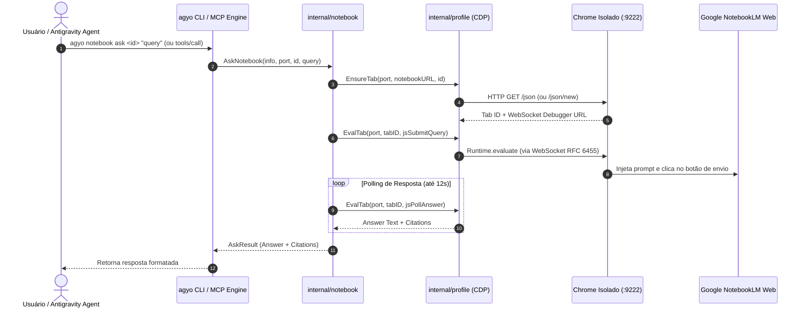

# Especificação: Integração Nativa Google NotebookLM & Servidor Stdio MCP (`08`)

## 1. Visão Geral e Motivação

O **Google NotebookLM** é amplamente utilizado por desenvolvedores e pesquisadores como um "cérebro" de contexto denso, capaz de indexar documentações técnicas, RFCs, PDFs e códigos-fonte para consultas fundamentadas com citações.

Entretanto, até o momento o Google **não disponibiliza uma API pública oficial** para o serviço. As alternativas comunitárias existentes sofrem de problemas crônicos:
1. **Atrito de Autenticação:** Exigem copiar manualmente cookies confidenciais (`SID`, `HSID`, `SSID`) através do Chrome DevTools.
2. **Fragilidade de RPCs Internos:** Chamadas diretas ao endpoint `batchexecute` usam identificadores obfuscados de 6 caracteres (`wXbhsf`, `s0tc2d`) que quebram frequentemente quando o Google atualiza o frontend.
3. **Dependências Externas:** Exigem interpretadores Python, `uvx`, ou scripts Node/npm adicionais.

O módulo `internal/notebook` do `agyo` resolve isso através do **Outer Harness**: utiliza a infraestrutura já existente de Chrome isolado (`~/.gemini/antigravity-browser-profile`) e cliente DevTools Protocol (CDP) em Go puro para interagir de forma determinística e segura com a aplicação web do NotebookLM, expondo uma interface CLI e um servidor **Model Context Protocol (MCP)** stdio nativo.

---

## 2. Diagrama de Arquitetura do Domínio



---

## 3. Estruturas de Dados Canônicas (`types.go`)

```go
type Notebook struct {
    ID          string `json:"id"`
    Title       string `json:"title"`
    URL         string `json:"url"`
    SourceCount int    `json:"source_count,omitempty"`
}

type Status struct {
    ChromeRunning bool   `json:"chrome_running"`
    Port          int    `json:"port"`
    HasTab        bool   `json:"has_tab"`
    TabID         string `json:"tab_id,omitempty"`
    IsLoggedIn    bool   `json:"is_logged_in"`
    ActiveURL     string `json:"active_url,omitempty"`
    Message       string `json:"message"`
}

type AskResult struct {
    NotebookID string   `json:"notebook_id"`
    Query      string   `json:"query"`
    Answer     string   `json:"answer"`
    Citations  []string `json:"citations,omitempty"`
}
```

---

## 4. Servidor Stdio MCP JSON-RPC 2.0 (`mcp.go`)

O `agyo notebook mcp` implementa a especificação canônica do **Model Context Protocol**:
- **Transporte:** Stdio (leitura de `os.Stdin`, escrita em `os.Stdout`)
- **Protocolo:** JSON-RPC 2.0 delimitado por quebras de linha (`\n`)
- **Ferramentas Expostas:**
  1. `notebooklm_status`: Retorna prontidão da conexão e autenticação.
  2. `notebooklm_list`: Retorna array de cadernos disponíveis.
  3. `notebooklm_ask`: Submete perguntas com parâmetros `notebook_id` e `query`.
  4. `notebooklm_push`: Submete notas com parâmetros `notebook_id`, `title` e `content`.

### Registro Automático (`agyo sync`)
Ao rodar `agyo sync`, o instalador inspeciona `~/.gemini/config/mcp_config.json` e injeta idempotentemente:
```json
{
  "mcpServers": {
    "notebooklm": {
      "command": "agyo",
      "args": ["notebook", "mcp"]
    }
  }
}
```

---

## 5. Garantias de Segurança e Privacidade

- **Local-First & Zero Telemetria:** Nenhuma credencial ou conteúdo de cadernos transita por servidores intermediários.
- **Isolamento de Sessão:** A sessão do Google vive restrita a `~/.gemini/antigravity-browser-profile`, sem cruzar com os perfis pessoais do usuário.
- **Resiliência a Mudanças de UI:** Empregou-se estratégias combinadas de seletores semânticos (`aria-label`, headings, botões e contenteditable) com fallbacks determinísticos.
