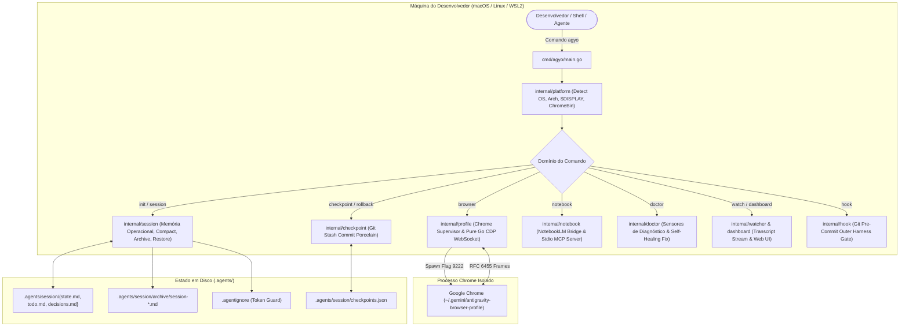

# Especificação de Engenharia e Arquitetura Canônica (`agyo`)

Bem-vindo à documentação aprofundada de arquitetura e design de sistemas do **Antigravity Operator (`agyo`)**.

Esta documentação foi desenhada para engenheiros de software, pesquisadores, arquitetos de IA e colaboradores open source que desejam entender **a dor profunda de desenvolvimento com agentes, as garantias de complexidade computacional, as decisões de design e o fluxo determinístico ponta a ponta** do operador.

---

## 🔥 A Dor Real: Por Que Agentes de IA Falham no Mundo Real?

Modelos de linguagem modernos (como o Gemini 1.5 Pro no Google Antigravity, Claude 3.5 Sonnet ou GPT-4o) possuem capacidades cognitivas impressionantes. No entanto, quando colocados para programar de forma autônoma no sistema operacional do desenvolvedor, **quatro modos críticos de falha arruínam a experiência**:

```text
┌────────────────────────────────────────────────────────────────────────────────────────┐
│                        OS 4 GRANDES GARGALOS DE AGENTES DE IA                          │
├──────────────────────────┬──────────────────────────┬──────────────────────────────────┤
│ 1. Amnésia & Context     │ 2. O Efeito              │ 3. Invasão de Browser            │
│    Bloat                 │    "Agente Bêbado"       │    & Segurança                   │
│                          │                          │                                  │
│ Conforme os turnos       │ O modelo altera arquivos │ O agente tenta usar o perfil     │
│ acumulam (+50 turnos), a │ às cegas sem rodar       │ pessoal do Chrome do dev:        │
│ atenção do modelo se     │ testes, entra em loops   │ conflito de lockfiles, cookies   │
│ fragmenta. Ele esquece   │ de refatoração quebrados │ de banco expostos e histórico    │
│ decisões acordadas e     │ e polui o Git com        │ pessoal inundado de abas de      │
│ queima cota de tokens.   │ dezenas de commits lixo. │ automação.                       │
├──────────────────────────┴──────────────────────────┴──────────────────────────────────┤
│ 4. O Abismo macOS vs Linux: Scripts que rodam no Mac quebram no Linux/Docker/WSL2      │
│    devido à falta de tela ($DISPLAY), problemas de GPU e permissões de sandbox.        │
└────────────────────────────────────────────────────────────────────────────────────────┘
```

---

## 💡 O Que o `agyo` Suprime e Resolve

O `antigravity-operator` foi concebido não como mais um chatbot ou wrapper de API, mas como um **Outer Harness & OS Engine** determinístico que blinda o ambiente do desenvolvedor:

1. **Suprime a Amnésia:** Fornece memória executiva estruturada no filesystem (`.agents/session/{state.md, decisions.md, todo.md}`). O modelo pode ser reiniciado 100 vezes e ainda assim saberá exatamente o objetivo, as premissas acordadas e a próxima linha de código a alterar.
2. **Suprime o Context Bloat ($O(1)$ Memory):** Com o algoritmo de **Rollup & Compaction**, tarefas antigas são arquivadas out-of-band em **0.19 ms**, reduzindo o footprint de tokens em até **~75% por turno** e mantendo a acurácia do modelo afiada mesmo no Turno 80.
3. **Suprime o Desperdício de Tokens (`.agentignore`):** Bloqueia a leitura inadvertida de `node_modules/`, `vendor/`, lockfiles densos de 50.000 linhas e arquivos `.env` confidenciais.
4. **Suprime o Medo de Refatorações Destrutivas (`checkpoint` & `rollback`):** Cria instantâneos atômicos do Git via objetos de stash commit sem poluir o histórico. Se a IA estragar o código, **um único comando `agyo rollback` restaura a working tree inteira em microssegundos**.
5. **Suprime a Invasão do Navegador Pessoal:** Orquestra uma instância 100% isolada do Google Chrome (`~/.gemini/antigravity-browser-profile`) na porta 9222 com protocolo DevTools nativo em Go (RFC 6455) e auto-fallback para modo headless em servidores Linux.

---

## 🏛️ Filosofia de Design e Princípios Fundamentais

O `agyo` foi construído sob quatro pilares inegociáveis de engenharia de software:

1. **Outer Harness Canônico (Martin Fowler):**
   Modelos de linguagem (LLMs) são motores probabilísticos atômicos. Sem um *outer harness* determinístico que forneça **Guias (Feedforward)** antes da execução e **Sensores (Feedback)** durante e após a execução, agentes inevitavelmente entram em *drifting*, repetição de erros e alucinação de paths.

2. **Zero Runtime Dependencies (Pure Go Standard Library):**
   O repositório mantém um `go.mod` estritamente limpo de bibliotecas externas de terceiros. Da camada de rede ao protocolo binário WebSocket RFC 6455 do Chrome DevTools, todo o runtime foi implementado utilizando **exclusivamente a biblioteca padrão do Go (`net`, `net/http`, `os`, `encoding/json`, `crypto`, `bufio`)**. Isso elimina riscos de *supply-chain attacks*, incompatibilidade entre kernels Linux e atrito de instalação.

3. **Complexidade de Memória Bounded a $O(1)$:**
   À medida que turnos de conversa avançam em sprints de código longos, o acúmulo linear de contexto degrada a atenção e a assertividade do modelo. O subsistema de sessão do `agyo` garante que a memória executiva ativa permaneça em tamanho constante através de compactação com rollup e arquivamento out-of-band.

4. **Isolamento de Segurança e Fronteiras Herméticas:**
   Agentes de IA nunca devem ter acesso ao perfil pessoal de navegação do usuário (cookies de banco, senhas, sessões corporativas). O operador instancia e comanda um sandbox dedicado do Google Chrome com porta e PID estritamente gerenciados.

---

## 🗺️ Mapa de Domínios da Arquitetura

A especificação completa está modularizada por domínios de responsabilidade única (SRP):

| Domínio | Especificação | O Que Cobre |
|---|---|---|
| **01. Entrada & Lifecycle** | [01-ENTRADA-E-BOOTSTRAP.md](01-ENTRADA-E-BOOTSTRAP.md) | Detecção de SO/arch, resolução de display server, CLI dispatcher, parsing de flags e bootstrap. |
| **02. Memória & Sessão** | [02-MEMORIA-OPERACIONAL-E-SESSAO.md](02-MEMORIA-OPERACIONAL-E-SESSAO.md) | `.agents/session/`, algoritmos de rollup $O(1)$, compaction em 0.19 ms, listagem e restauração com backup preventivo. |
| **03. Token Protection** | [03-TOKEN-GUARD-E-AGENTIGNORE.md](03-TOKEN-GUARD-E-AGENTIGNORE.md) | `.agentignore`, heurísticas de exclusão de lockfiles, minificados, dumps e prevenção de context bloat. |
| **04. Safety Net & Git** | [04-FILESYSTEM-SAFETY-NET-CHECKPOINT.md](04-FILESYSTEM-SAFETY-NET-CHECKPOINT.md) | Snapshots atômicos via `git stash create`, restauração via rollback e botão de pânico sem poluir o histórico git. |
| **05. Chrome & CDP** | [05-SUPERVISAO-CHROME-E-CDP-PURO.md](05-SUPERVISAO-CHROME-E-CDP-PURO.md) | Perfil isolado, flags headless dinâmicas, PID tracking e implementação nativa de cliente WebSocket RFC 6455 para Chrome DevTools Protocol. |
| **06. Observabilidade & Watch** | [06-OBSERVABILIDADE-WATCHER-E-DASHBOARD.md](06-OBSERVABILIDADE-WATCHER-E-DASHBOARD.md) | Streaming JSONL reativo de transcript, árvore de subagentes concorrente, alertas nativos de SO e Dashboard Web HTTP. |
| **07. Sensores & Self-Healing** | [07-SENSORES-DOCTOR-E-SELF-HEALING.md](07-SENSORES-DOCTOR-E-SELF-HEALING.md) | Diagnóstico computacional, pre-commit hook de continuidade, autorrecuperação (`doctor --fix`) e contrato machine-readable `--json`. |
| **08. NotebookLM & MCP** | [08-NOTEBOOKLM-E-MCP-SERVER.md](08-NOTEBOOKLM-E-MCP-SERVER.md) | Ponte nativa com Google NotebookLM via CDP, extração de fontes e servidor MCP stdio JSON-RPC 2.0. |

---

## 🔄 Visão Panorâmica do Fluxo de Execução



---

## ⚖️ Matriz de Decisões Técnicas & Trade-Offs de Arquitetura

Cada escolha arquitetural no `agyo` foi deliberadamente pesada considerando seus trade-offs:

| Decisão Técnica | O Que Foi Escolhido | Alternativa Rejeitada | Racional & Trade-Off Assumido |
|---|---|---|---|
| **Dependências de Runtime** | **Zero External Deps (Pure Go stdlib)** | Usar bibliotecas externas (`gorilla/websocket`, `cobra`, `rod`, `chromedp`) | **Vantagem:** Binário estático puro de ~6MB, zero CVEs de supply-chain, compilação instantânea sem quebras de versão.<br>**Trade-off:** Exigiu implementar manualmente o handshake e mascaramento RFC 6455 de WebSockets em Go puro. |
| **Safety Net do Filesystem** | **`git stash create` commit objects** | Criar commits temporários no histórico (`git commit -m "temp"`) ou snapshot de pastas (`rsync / zip`) | **Vantagem:** Snapshots em <15 ms sem poluir o `git log` e sem duplicar gigabytes em disco.<br>**Trade-off:** Depende da presença do Git instalado na máquina do usuário. |
| **Persistência de Memória** | **Markdown em disco (`.agents/session/`)** | Banco relacional/vetorial local (SQLite, DuckDB, Chroma) | **Vantagem:** 100% legível por humanos, inspecionável via terminal/editor, versionável no Git e sem processos daemon em background.<br>**Trade-off:** Exige parsing manual de listas e headers em texto plano. |
| **Gestão do Navegador** | **Chrome nativo isolado na porta 9222** | Puppeteer/Playwright empacotado em container Docker | **Vantagem:** Inicia em 300 ms, usa o Chrome já instalado na máquina, consome pouca RAM e suporta headless automático.<br>**Trade-off:** Requer que o usuário tenha o Chrome ou Chromium instalado no SO. |
| **Algoritmo de Compaction** | **Rollup cumulativo de tarefas concluídas** | Apagar tarefas concluídas ou sumarizar com LLM secundária | **Vantagem:** Execução em **0.19 ms**, determinismo 100%, zero custo de tokens para compactar.<br>**Trade-off:** O resumo é sintético estruturado, e não um texto narrativo gerado por IA. |
| **Interface com Sistemas** | **CLI Dual-Mode (Humano + `--json`)** | Apenas saída para terminal ou apenas servidor gRPC/HTTP | **Vantagem:** O desenvolvedor tem experiência visual rica (emojis, badges, tabelas) enquanto scripts e agentes usam JSON limpo.<br>**Trade-off:** Manutenção de lógica de formatação dupla nas saídas dos comandos. |

